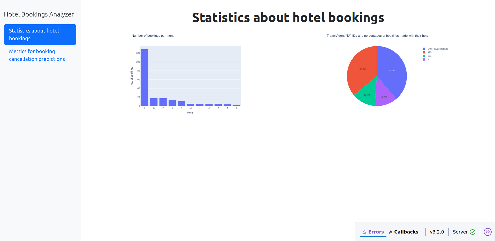

# hotel-bookings-analyzer
Hotel Bookings Analyzer - A data analysis project about hotel bookings

# Business Questions

The goal of the project is to analyze business problems related to hotel bookings.

1. Which travel agents (TAs) are frequently used for making bookings?
&rarr; By identifying which TAs bring in several bookings, the properties/hotels could make better negotiations with them.
2. Which bookings might be cancelled by the guests? Also, which factors influence this prediction?
&rarr; One important classification problem to be solved is to recognize when a booking will be cancelled. This could prevent customer churn and provide a better experience for the guests.
Therefore, a machine learning model is used for this task. By identifying guests who might cancel bookings, solutions such as offering flexible rebooking options could be employed [4].
Furthermore, we are also interested in which features have the biggest impact on the model's output.

# Dataset
The used dataset for this project is "Hotel Booking Demand" [1] from Kaggle.
The dataset was originally published by a group of researchers [2], and then it was processed by people participating in the #tidytuesday project [3]. 
The data should be downloaded and placed in the "data" directory, which is inside the project's root directory ("data/hotel_bookings.csv").

# Analysis results

1. Approximately 61% of the bookings are made by three TAs.
2. Features such as the booking lead time ("lead_time") and average daily rate ("adr") have a great influence on the ML model's predictions.

# Technical details
- By running "app.py", the user can access the dashboard
- Python version: 3.12
- The needed dependencies can be found in the "requirements.txt" file, which was generated using the package manager "pip"
- The usage of a virtual environment is recommended

# References

[1] J. Mostipak (Kaggle user), "Hotel booking demand", https://www.kaggle.com/datasets/jessemostipak/hotel-booking-demand, last accessed: 06.08.2025

[2] N. Antonio, A. de Almeida, and L. Nunes, "Hotel booking demand datasets", in Data in Brief, Volume 22, p. 41-49, ISSN 2352-3409, 2019.

[3] "Hotels" dataset, #tidytuesday project, GitHub, https://github.com/rfordatascience/tidytuesday/blob/main/data/2020/2020-02-11/readme.md, last accessed: 06.08.2025

[4] T. Brown, "How to minimize hotel booking cancelations", MEWS, https://www.mews.com/en/blog/minimize-hotel-booking-cancelations, 20 Jul 2021